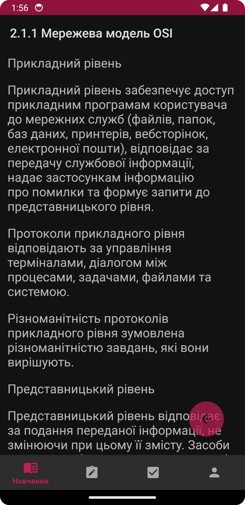
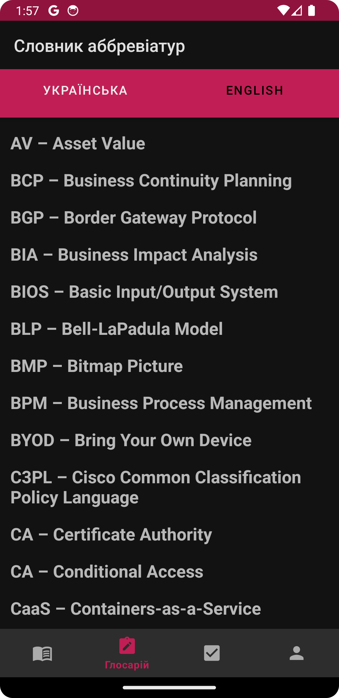
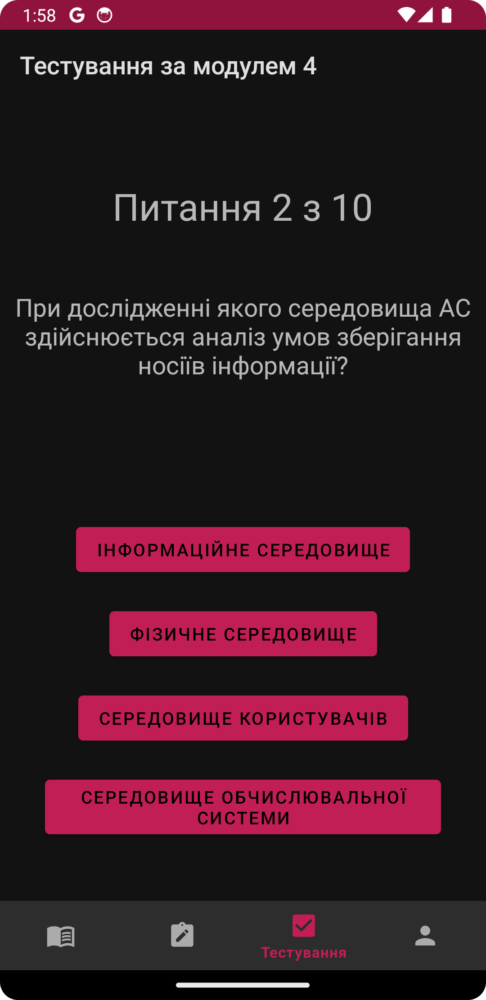

# ЄДКІ. Кібербезпека

| [Завантажити ЄДКІ. Кібербезпека v1.0](https://github.com/ArchExalt/edki-cybersecurity-android/releases/tag/stable) | [Privacy Policy](https://archexalt.github.io/edki-cybersecurity-android/) |
| --- | --- |

SHA-256: 9f163332d9df1d4978b83246d7789b555f281cc7ab70009c83f25437454bf1e6

Оновлення v1.0 (08.08.24):

- первинний реліз.

---

Застосунок створено для підготовки до Єдиного Державного Кваліфікаційного Іспиту за спеціальністю 125 (Кібербезпека та захист інформації).

Наразі доступно: 7 модулів, що поділяються на 22 теми та 112 лекцій; 267 тестових питань.

Функціонал:
- вхід через обліковий запис Google та вихід із нього;
- можливість відмічати прапорцями завершені лекції;
- статистика щодо кількості завершених лекцій;
- випадкові питання для тестування за всіма модулями та за кожним окремо;
- список скорочень українською та англійською мовами;
- перемикання між світлою/темною темою.

Якщо у вас виникли запитання, ви хотіли б зробити внесок у застосунок або повідомити про помилку, не соромтеся відкрити Issue на GitHub або зв’язатися зі мною електронною поштою archexalt@proton.me.

Особлива подяка kgnokt за заощадження часу шляхом форматування текстів.

Якщо ви бажаєте мене підтримати:

---

   

